# AR_Invoice_App

A custom web application built on **Oracle Visual Builder Cloud Service (VBCS)** that integrates with **Oracle Fusion Cloud ERP** to manage Accounts Receivable (AR) Invoices — create, edit, delete, and submit invoices directly into Oracle's AR module.

---
## Overview

This app simplifies AR invoice management by providing a clean, user-friendly interface on top of Oracle Fusion Cloud. Users can manage the full invoice lifecycle from a single screen — without navigating Oracle's complex native UI. All data is fetched and submitted in real time through Oracle REST APIs.

---
## Application Walkthrough

### 1. Invoice List

When the app loads, it fetches all existing AR invoices and displays them in a table. Each row shows the Invoice ID, Customer Number, Business Unit, Status, Transaction Number, Total Amount, Discount, and Final Amount. By default, the Edit and Delete buttons are disabled until a row is selected.

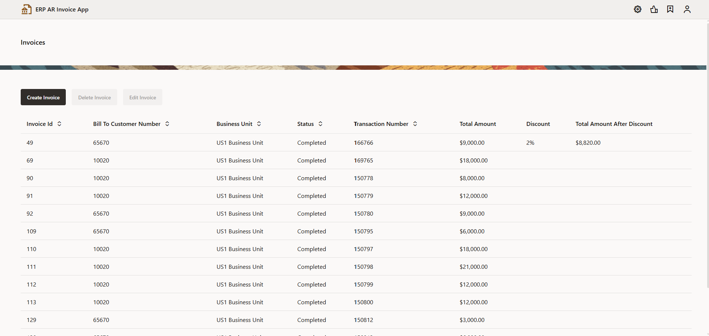

---

### 2. Row Selection — Edit & Delete

Clicking any row in the list highlights it and activates the **Edit Invoice** and **Delete Invoice** buttons. This prevents accidental edits or deletions.

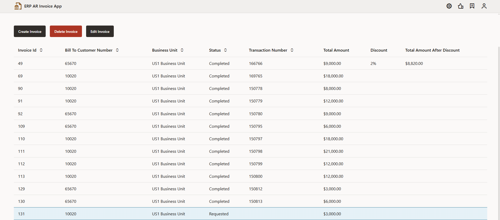

---

### 3. Create Invoice — Auto-Population on Customer Selection

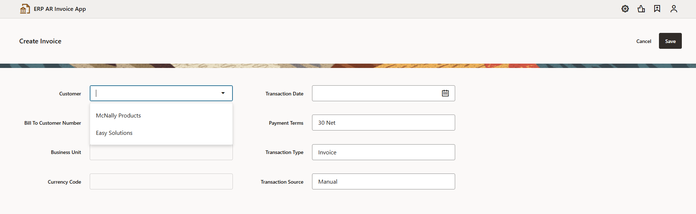

Clicking **Create Invoice** opens a blank form. When the user selects a **Customer** from the dropdown, the following fields are automatically populated based on the selected customer's data fetched from BO.

- **Bill To Customer Number** — auto-filled (e.g., 65670)
- **Business Unit** — auto-filled (e.g., US1 Business Unit)
- **Currency Code** — auto-filled (e.g., USD)
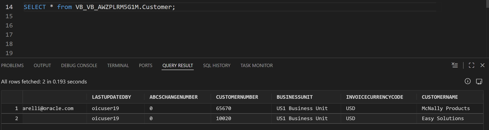

Fields like Payment Terms, Transaction Type, and Transaction Source are pre-set with default values. The user only needs to fill in the Transaction Date and proceed to add invoice lines.

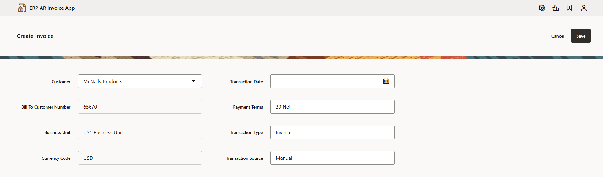

---

### 4. Edit / Create Invoice Form

Clicking **Edit Invoice** or **Create Invoice** opens the invoice form pre-populated with existing data (for edit) or blank (for create). The form includes all invoice header details — Customer, Transaction Date, Payment Terms, Business Unit, Transaction Type, Currency, and more — along with an invoice Lines section where line items can be added or removed.

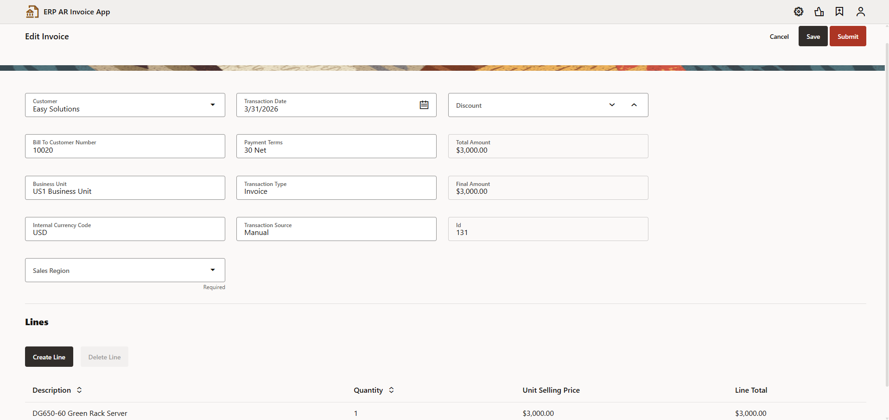

#### 4.1 Create Line — Auto-Population on Product Selection

Clicking **Create Line** opens a blank line form with fields for Product, Description, Unit Selling Price, Quantity, and Line Total. When the user selects a **Product** from the dropdown (e.g., Ultra Power Server 2000, DG650-60 Green Rack Server, License), the following fields are automatically populated:

- **Description** — auto-filled based on selected product
- **Unit Selling Price** — auto-filled with the product's price (e.g., $2,000.00)

When the user enters the **Quantity**, the **Line Total** is automatically calculated:
> Quantity × Unit Selling Price = Line Total (e.g., 4 × $2,000.00 = $8,000.00)

---

### 5. Sales Region — Custom DFF Field with Live LOV

**Sales Region** is a custom **Descriptive Flexfield (DFF)** created in Oracle Fusion Cloud. When the user opens this dropdown, the app calls Oracle Cloud in real time to fetch the List of Values configured in Oracle's Value Set. This means the dropdown always reflects whatever values are set in Oracle — no hardcoding in the app.

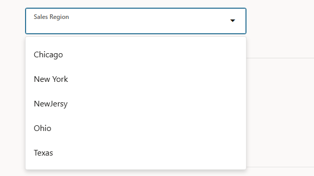

---

### 6. Submitting the Invoice to Oracle

When the user clicks **Submit**, the complete invoice payload (header + lines + Sales Region DFF value) is sent to Oracle Fusion Cloud via REST API. Oracle processes the transaction, creates it in the AR module, and returns a **Transaction Number** as confirmation.

A notification appears: *"AR Invoice created in ERP Cloud successfully"* along with the Transaction Number.

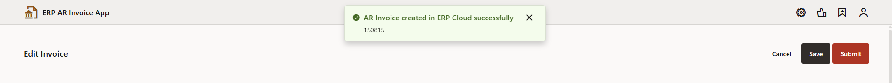

---

### 7. Invoice Status Updated

After a successful submit, the invoice list refreshes and the submitted record's status changes to **Completed** with the Transaction Number populated — confirming the record is live in Oracle.

---

### 8. Verification in Oracle Fusion Cloud

The submitted invoice can be cross-verified directly in Oracle's native **Manage Transactions** screen by searching the Transaction Number. All fields — including the custom **Sales Region1** DFF field — are visible and correctly stored in Oracle.

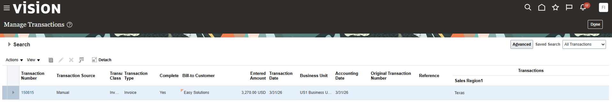

---

## Business Objects

The app uses **VBCS Business Objects** as its local data layer to store and manage invoice data within the application — Invoice (header level) and Invoice Lines (line item level). These are bound to the UI components and synced with Oracle Cloud through service connections.

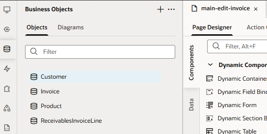

---
## Service Connections

**Service Connections** in VBCS define the REST API integrations with Oracle Fusion Cloud. This app uses dedicated service connections for:

- Fetching and managing AR invoices (CRUD operations)
- Managing invoice line items
- Fetching the Sales Region List of Values from Oracle's DFF Value Set in real time
- Authenticating with Oracle Fusion Cloud

All connections point to Oracle's standard FSCM REST API endpoints and are secured using Oracle credentials configured at the VBCS backend level.

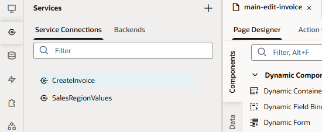

---
